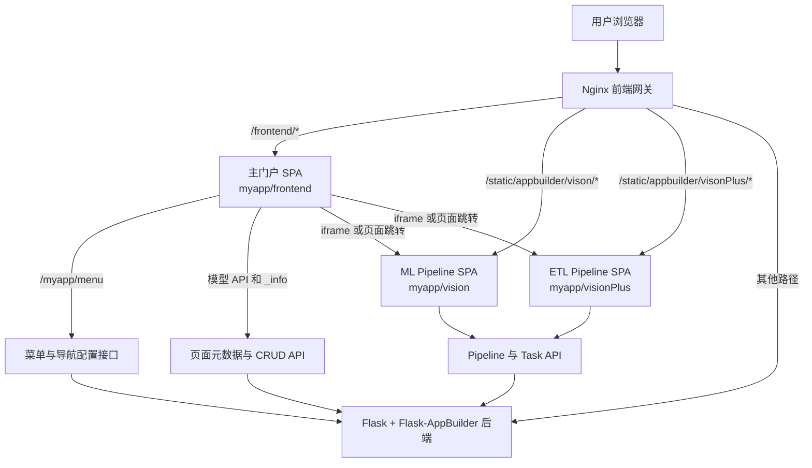
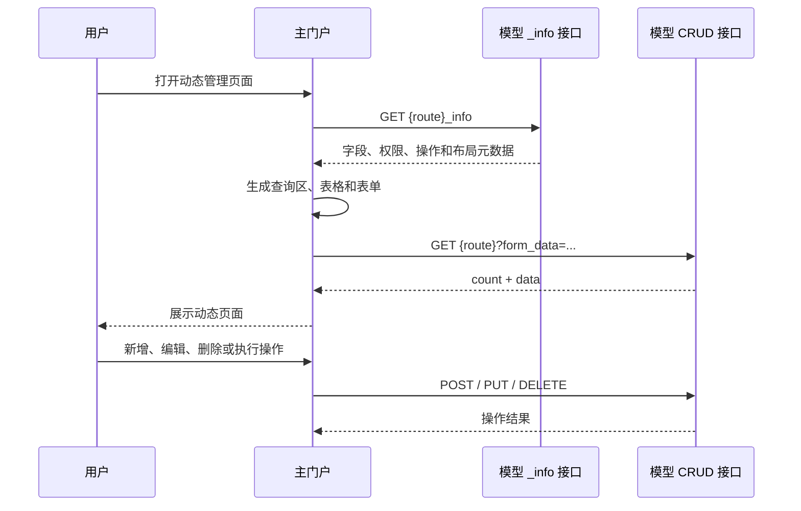
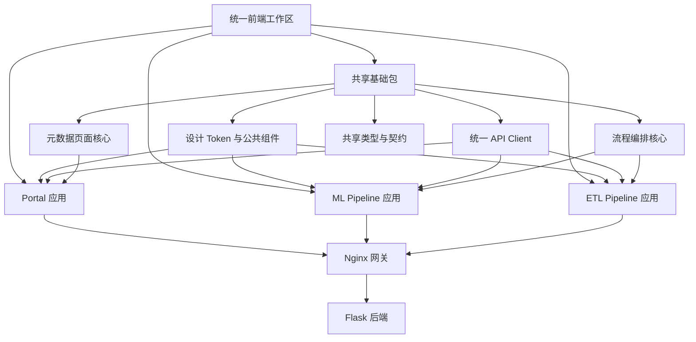

# Cube-Studio 前端架构分析报告

> 分析日期：2026年9月21日  
> 分析对象：Cube-Studio 当前工作区前端源码、构建配置及部署配置  
> 分析范围：`myapp/frontend`、`myapp/vision`、`myapp/visionPlus` 及相关后端菜单接口、静态资源和 Nginx 配置  
> 说明：本报告基于静态源码分析，包含当前工作区中尚未提交的本地修改。

## 1. 执行摘要

Cube-Studio 前端不是单一 React 应用，而是由三个独立构建的单页应用组成：

1. `myapp/frontend`：平台主门户，负责登录检查、全局导航、动态路由、通用管理页面和业务入口。
2. `myapp/vision`：机器学习 Pipeline 可视化编排应用。
3. `myapp/visionPlus`：ETL Pipeline 可视化编排应用。

三个应用通过 Nginx 部署在同一个域名下。主门户运行在 `/frontend/`，两个编排应用运行在 `/static/appbuilder/vison/` 和 `/static/appbuilder/visonPlus/`。主门户通过页面跳转或 iframe 调用子应用，其他请求由 Nginx 反向代理到 Flask／Flask-AppBuilder 后端。

因此，该系统可以概括为：

> **后端元数据驱动的 React 管理门户 + 两个独立流程编排 SPA + Nginx 同域聚合。**

它属于多 SPA 静态集成架构，不是标准微前端架构。项目没有使用 Module Federation、single-spa、qiankun 等微前端运行时，也没有统一的前端工作区和跨应用状态管理机制。

主门户最突出的设计是 **Server-Driven UI／Schema-Driven CRUD**：菜单、页面字段、列表列、表单结构、操作按钮和权限主要由后端元数据决定，前端通过通用页面引擎渲染。这种设计显著提高了管理后台的开发效率，但也使前后端协议耦合较强，并导致通用模板组件持续膨胀。

当前主要架构风险包括：

- 大量动态 HTML 直接渲染，存在 XSS 攻击面。
- 三个工程均允许 TypeScript 编译错误不阻断生产构建。
- 通用 CRUD 页面 `ADUGTemplate.tsx` 超过 2,000 行，职责过重。
- `vision` 和 `visionPlus` 通过复制代码独立演进，重复维护成本较高。
- 三套工程的路由、Axios、Ant Design 等依赖版本不统一。
- 自动化测试覆盖明显不足。

建议采用渐进式治理：先建立类型、安全和测试门禁，再拆分通用页面、抽取两个编排器的共享核心，最后统一基础设施。当前没有整体重写或立即引入微前端框架的必要。

## 2. 分析范围与方法

本次分析覆盖以下内容：

- 前端工程目录和依赖配置；
- 应用入口、路由和页面组织；
- 状态管理方式；
- API 请求与认证处理；
- 后端菜单和页面元数据接口；
- 编排器的画布、编辑器和 Redux 模块；
- 构建输出目录；
- Docker、Kubernetes 和 Nginx 部署方式；
- 代码规模、重复代码、测试和潜在安全风险。

本报告主要依据以下源码与配置：

- `myapp/frontend/package.json`
- `myapp/frontend/src/index.tsx`
- `myapp/frontend/src/App.tsx`
- `myapp/frontend/src/routerConfig.tsx`
- `myapp/frontend/src/pages/ADUGTemplate.tsx`
- `myapp/frontend/src/components/DynamicForm/DynamicForm.tsx`
- `myapp/frontend/src/api/`
- `myapp/vision/`
- `myapp/visionPlus/`
- `myapp/views/home.py`
- `install/docker/dockerFrontend/`
- `install/kubernetes/cube/base/deploy-frontend.yaml`

## 3. 总体架构



### 3.1 应用清单

| 工程 | 定位 | 核心技术 | 生产访问路径 |
|---|---|---|---|
| `myapp/frontend` | 平台门户和通用管理后台 | React 17、TypeScript、React Router 6、Ant Design 4、Axios、Webpack 5 | `/frontend/` |
| `myapp/vision` | 机器学习 Pipeline 编排器 | React 17、React Router 5、Redux Toolkit、React Flow、Monaco、Fluent UI | `/static/appbuilder/vison/` |
| `myapp/visionPlus` | ETL Pipeline 编排器 | React 17、React Router 5、Redux Toolkit、React Flow、Monaco | `/static/appbuilder/visonPlus/` |

三个工程各自维护 `package.json` 和依赖锁文件。仓库没有使用 pnpm workspace、Yarn workspace、Nx、Turborepo 等 Monorepo 管理工具，因此它更接近“单仓库内放置多个独立应用”，而不是工程化意义上的 Monorepo。

### 3.2 应用间集成方式

应用间采用以下方式集成：

- 使用 Nginx 将不同 URL 前缀映射到不同静态目录；
- 使用同一域名共享 Cookie 和登录状态；
- 主门户根据后端菜单配置决定导航入口；
- 对部分子应用使用 iframe 嵌入；
- 对部分独立页面使用新窗口或当前页面跳转；
- 各应用直接访问相同的后端 API。

这种方式的优点是实现简单、部署稳定、认证处理直接。缺点是缺乏统一的应用生命周期、共享组件机制、跨应用通信协议和依赖治理。

## 4. 主门户架构分析

### 4.1 启动流程

主门户入口位于 `myapp/frontend/src/index.tsx`，启动过程如下：

1. 加载全局样式和主题。
2. 设置 Ant Design 中文语言环境。
3. 设置全局加载动画。
4. 读取 `myapp_username` Cookie。
5. 未发现 Cookie 时跳转 `/login/`。
6. 登录后创建 `BrowserRouter`。
7. 使用 `REACT_APP_BASE_ROUTER` 设置路由基路径。
8. 渲染 `App` 应用壳层。

生产环境中路由基路径为 `/frontend/`，对应配置文件 `myapp/frontend/.env.production.frontend`。

需要注意，前端 Cookie 检查只能作为用户体验层面的入口控制。真正的认证和授权仍必须由后端接口负责。

### 4.2 应用壳层

`myapp/frontend/src/App.tsx` 是主门户的应用壳，主要负责：

- 请求并生成动态菜单；
- 建立运行时路由；
- 渲染顶部导航；
- 渲染侧边菜单；
- 管理菜单展开和折叠状态；
- 根据当前 URL 同步导航选中状态；
- 加载右上角导航配置；
- 加载当前页面的自定义弹窗；
- 渲染用户中心和退出入口；
- 挂载全局 AI 助手。

该组件约 438 行，既承担全局布局，又承担动态路由和菜单状态管理。当前仍可工作，但随着平台导航能力增加，建议将其拆分为 `AppShell`、`HeaderNavigation`、`SideNavigation`、`RuntimeRouter` 和相关 Hooks。

### 4.3 后端驱动菜单

门户启动后通过 `/myapp/menu` 获取菜单树。后端实现位于 `myapp/views/home.py`，会根据用户身份、管理员状态、系统配置和权限生成菜单。

前端接收菜单后调用 `formatRoute()` 将菜单转换为 React Router 路由对象，并与本地固定路由合并。固定路由主要包括首页、用户中心、数据查询、通用关系图和 404 页面。

后端菜单支持的主要类型如下：

| `menu_type` | 前端处理方式 |
|---|---|
| `api` | 使用通用 `ADUGTemplate` 渲染管理页面 |
| `innerRoute` | 匹配并加载本地定制 React 页面 |
| `iframe` | 使用 `IframeTemplate` 嵌入目标页面 |
| `out_link` | 打开外部链接 |
| `in_link` | 打开站内独立链接 |

该设计使菜单、页面入口和后端权限保持较高一致性，同时也意味着菜单响应格式是前端的关键运行时契约。

### 4.4 元数据驱动 CRUD

`myapp/frontend/src/pages/ADUGTemplate.tsx` 是主门户最重要的通用页面引擎。它通过后端 `_info` 接口获取页面定义，并动态生成完整的后台管理界面。

主要元数据包括：

- `list_columns`：列表字段；
- `add_columns`：新增表单字段；
- `edit_columns`：编辑表单字段；
- `label_columns`：字段名称；
- `description_columns`：字段描述；
- `filters`：查询条件；
- `permissions`：操作权限；
- `action`：单条和批量操作；
- `route_base`：CRUD API 根路径；
- `primary_key`：主键；
- `add_fieldsets`、`edit_fieldsets`：表单分组；
- `column_related`：字段联动；
- `list_ui_type`：列表或卡片布局；
- `import_data`、`download_data`：导入导出能力；
- `enable_favorite`：收藏能力；
- `echart`：图表能力。

前端根据这些配置动态完成：

- 查询条件生成；
- 表格列生成；
- 新增和编辑表单生成；
- 字段校验；
- 字段联动；
- 分页和排序；
- 详情展示；
- 单行操作和批量操作；
- 卡片和表格切换；
- 文件上传、导入和下载。

典型调用链如下：



这是 Cube-Studio 前端平台化能力的核心。普通管理模块主要通过后端模型和元数据配置扩展，前端不需要为每个数据模型重复开发列表与表单。

### 4.5 本地定制页面

不适合通用 CRUD 模板的页面由本地 React 组件实现，主要包括：

- 首页；
- 数据查询；
- 数据发现；
- 通用关系图；
- 用户中心；
- 数据展示；
- iframe 和外链模板；
- AI 助手。

这些页面通过 `React.lazy` 按需加载，减少主入口的初始加载量。

### 4.6 状态管理

主门户依赖中包含 MobX，并在 `src/store/index.ts` 中调用了 `configure({ enforceActions: 'always' })`，但没有发现实际的 MobX Store、Observable Model 或 Observer 组件。

当前真实的状态管理方式主要是：

- React `useState`；
- React `useRef`；
- URL 路径和查询参数；
- Cookie；
- `localStorage`；
- 页面局部状态。

因此，主门户应被定义为组件局部状态架构，而不是 MobX 架构。MobX 相关依赖目前可能属于历史遗留。

### 4.7 API 层

主门户在 `src/api/index.tsx` 中创建了统一 Axios 实例，主要处理：

- 登录 Cookie 检查；
- 401 登录过期跳转；
- 502 网络状态提示；
- 后端 `api_flashes` 消息；
- 错误通知队列；
- 特定请求的静默错误模式。

业务 API 按功能拆分到 `src/api/` 下，例如：

- `kubeflowApi.ts`
- `home.ts`
- `dataSearchApi.ts`
- `commonPipeline.ts`
- `userinfoApi.ts`

API 层已经与页面组件形成基本分离，但仍存在大量 `any`，不同接口的响应结构也没有完全统一。

## 5. Pipeline 编排应用架构

### 5.1 `vision` 工程

`myapp/vision` 是机器学习 Pipeline 可视化编辑器。它采用以下技术：

- React 17；
- React Router 5；
- Redux Toolkit；
- React Flow；
- Monaco Editor；
- Ant Design；
- Fluent UI；
- Axios；
- Less。

应用入口组合了：

```text
ThemeProvider
└── React.StrictMode
    └── Redux Provider
        └── HashRouter
            └── AppRouter
```

使用 HashRouter 可以避免静态子目录部署时由服务端处理内部路由。

### 5.2 Redux 模块

`vision` 的 Redux Store 包含以下 Slice：

| Slice | 推测职责 |
|---|---|
| `app` | 应用级状态和用户信息 |
| `editor` | 编辑器状态 |
| `element` | 流程节点和连线元素 |
| `pipeline` | Pipeline 信息 |
| `setting` | 设置面板状态 |
| `task` | 当前任务及任务操作 |
| `template` | 任务模板和模板树 |

编排器涉及节点拖放、节点配置、连线、保存、撤销及多个组件协作，使用 Redux Toolkit 比主门户的局部状态方式更符合业务复杂度。

### 5.3 核心组件

`vision` 的主要组件结构为：

```text
FlowEditor
├── EditorHead
├── EditorTool
├── EditorBody
│   ├── DataSet
│   ├── Model
│   └── Setting
└── ErrorTips

ModuleTree
├── SearchItem
├── ModuleItem
└── ModuleDetail

EditorAce
└── VisualizedData
```

它直接调用 Pipeline、Task、Job Template 和 Project 等后端 API，实现 Pipeline 的查询、新增、编辑、删除、复制和运行。

### 5.4 `visionPlus` 工程

`myapp/visionPlus` 是面向 ETL 场景的流程编排应用。它与 `vision` 的技术结构基本一致，但根据 ETL 业务调整了节点、配置项和代码编辑能力。

源码对比结果如下：

| 对比项 | 数量 |
|---|---:|
| 两个工程共有的同路径源码文件 | 53 |
| 内容完全相同 | 27 |
| 路径相同但内容不同 | 26 |
| 仅 `vision` 存在 | 7 |
| 仅 `visionPlus` 存在 | 0 |

这表明 `visionPlus` 很可能由 `vision` 复制后演化而来。目前它们属于两个相似但独立维护的应用，没有共享前端核心包。

### 5.5 子应用接入方式

两个应用的生产构建目录分别由 `config-overrides.js` 修改为：

```text
myapp/static/appbuilder/vison
myapp/static/appbuilder/visonPlus
```

主门户和后端通过以下 URL 打开编排器：

```text
/static/appbuilder/vison/index.html?pipeline_id={id}
/static/appbuilder/visonPlus/index.html?scenes=etl_pipeline&pipeline_id={id}
```

应用使用查询参数读取当前 Pipeline ID，再从后端加载 Pipeline 和 Task 数据。

## 6. 构建架构

### 6.1 主门户构建

主门户从 Create React App 构建链修改而来，但维护了自己的 Webpack 配置和脚本：

```text
myapp/frontend/
├── config/
│   ├── webpack.config.js
│   ├── webpackDevServer.config.js
│   ├── paths.js
│   └── env.js
├── scripts/
│   ├── start.js
│   ├── build.js
│   └── test.js
└── package.json
```

生产构建使用 `APP_ENV=frontend`，并读取 `.env.production.frontend`：

```dotenv
PUBLIC_URL=/frontend/
BUILD_PATH=../static/appbuilder/frontend
REACT_APP_BASE_ROUTER=/frontend/
```

因此，主门户执行构建后会直接将产物写入：

```text
myapp/static/appbuilder/frontend
```

### 6.2 子应用构建

`vision` 和 `visionPlus` 使用 `react-app-rewired` 与 `config-overrides.js` 修改 CRA 默认配置，主要完成：

- 修改生产构建输出目录；
- 添加 `@src` 路径别名；
- 注入 Monaco Webpack Plugin；
- 限定 Monaco 打包语言；
- 关闭 source map。

### 6.3 构建流程

后端容器构建脚本中的前端步骤为：

```text
1. 构建 myapp/frontend
2. 构建 myapp/vision
3. 构建 myapp/visionPlus
4. 将三个构建结果保存在 myapp/static/appbuilder
5. 构建或挂载 Nginx 前端容器
```

三个应用目前分别安装依赖，缺少统一的依赖缓存、并行构建和锁文件一致性治理。

## 7. 部署架构

### 7.1 Nginx 路由

Nginx 的核心路由规则为：

| URL | 处理方式 |
|---|---|
| `/` | 重定向到 `/frontend/` |
| `/frontend/` | 从 `/data/web/frontend` 提供主门户静态资源 |
| `/static/appbuilder/` | 从 `/data/web/static/appbuilder` 提供子应用静态资源 |
| 其他路径 | 反向代理到 Flask 后端 |

主门户使用 BrowserRouter，因此 `/frontend/` 配置了 `try_files` 回退到 `/frontend/index.html`。两个子应用使用 HashRouter，静态服务器不需要识别其内部路由。

### 7.2 同域认证

静态前端与后端 API 使用同一域名，因此：

- 浏览器会自动携带认证 Cookie；
- 不需要配置生产跨域；
- 登录、登出和 API 地址可以使用相对路径；
- 主门户和子应用可以共享后端会话。

这是当前部署架构的重要优点。

### 7.3 Docker 与 Kubernetes

前端容器基于 Nginx，镜像中包含：

```text
/data/web/frontend
/data/web/static
```

Kubernetes 部署中，`kubeflow-dashboard-frontend` Deployment 独立运行 Nginx，后端由 `kubeflow-dashboard.infra` 服务提供。Docker Compose 开发环境则将前端目录直接挂载到前端容器。

## 8. 代码规模和工程现状

### 8.1 源码规模

静态统计结果如下：

| 工程 | 源码文件 | 主要代码文件 | 约计代码行数 |
|---|---:|---:|---:|
| `myapp/frontend/src` | 151 | 100 | 16,702 |
| `myapp/vision/src` | 60 | 58 | 5,590 |
| `myapp/visionPlus/src` | 53 | 51 | 4,336 |

关键文件规模：

| 文件 | 行数 |
|---|---:|
| `ADUGTemplate.tsx` | 2,074 |
| `DynamicForm.tsx` | 683 |
| `App.tsx` | 438 |

### 8.2 类型系统

三个工程的 TypeScript 配置均开启 `strict`，但同时存在以下情况：

- 主门户约有 349 处 `any` 文本使用；
- `vision` 约有 184 处；
- `visionPlus` 约有 108 处；
- 构建命令设置 `TSC_COMPILE_ON_ERROR=true`。

因此，当前属于“使用 TypeScript 编写代码，但生产构建没有严格执行类型门禁”的状态。

### 8.3 测试现状

源码范围内只发现主门户的一个测试文件：

```text
myapp/frontend/src/App.test.tsx
```

没有发现 `vision` 和 `visionPlus` 的业务测试。这不足以覆盖动态菜单、元数据渲染、复杂表单和流程编排等关键能力。

## 9. 架构优点

### 9.1 管理后台扩展效率高

后端只要提供模型 API、页面元数据和菜单配置，前端通用模板就能生成列表、查询、详情、新增和编辑页面。对于数据和模型数量较多的 AI 平台，这种方式可以显著减少重复开发。

### 9.2 权限与页面入口一致

菜单、按钮权限和模型能力主要由后端控制，能够减少前端菜单可见但接口不可用，或者接口已开放但前端没有入口的问题。

### 9.3 复杂领域应用得到隔离

流程编排器包含画布、节点、连线、代码编辑器和复杂状态。如果全部放入门户工程，会明显增加门户复杂度。当前独立应用方式使故障和依赖升级具有一定隔离性。

### 9.4 支持按需加载

主门户和子应用均对页面使用懒加载，能够避免所有业务代码一次性进入初始 Bundle。

### 9.5 部署简单

Nginx 统一提供静态资源并反向代理后端，部署结构直接，同域认证也减少了生产环境的跨域复杂度。

## 10. 风险与问题

### 10.1 P0：动态 HTML 渲染存在安全风险

源码中存在大量 `dangerouslySetInnerHTML`：

| 工程 | 约计使用次数 |
|---|---:|
| 主门户 | 60 |
| `vision` | 9 |
| `visionPlus` | 8 |

渲染内容包括：

- 菜单 SVG；
- 后端字段描述；
- 表格内容；
- 操作按钮；
- Markdown 转换结果；
- 自定义弹窗；
- Pipeline 参数描述。

如果内容中混入用户可控数据，可能形成存储型或反射型 XSS。

建议：

1. 建立统一的 HTML 和 SVG 清洗函数。
2. 使用 DOMPurify 等成熟方案进行白名单过滤。
3. 普通文本默认按文本渲染，只有明确标记为可信 HTML 的字段才允许富文本。
4. 对 Markdown 转换结果执行二次清洗。
5. 建立后端富文本字段白名单和来源约束。

### 10.2 P0：iframe 权限范围偏大

`IframeTemplate` 当前允许：

```text
microphone; camera; midi; encrypted-media
```

同时没有设置 `sandbox`。如果 iframe URL 可被配置或查询参数控制，风险会进一步扩大。

建议：

- 按业务场景最小化 `allow`；
- 增加 URL 白名单；
- 为 iframe 增加适当的 `sandbox`；
- 避免直接信任任意 `url` 查询参数；
- 对外部页面优先使用新窗口并设置安全属性。

### 10.3 P0：生产构建允许类型错误

三个工程构建命令都启用了 `TSC_COMPILE_ON_ERROR=true`。这会造成类型检查失败但构建仍成功，可能把接口字段变更、空值问题和错误参数带入生产环境。

建议在 CI 中增加独立门禁：

```bash
npx tsc --noEmit
```

生产镜像只能在类型检查通过后构建。为避免一次整改影响过大，可以先对新增和修改代码实施门禁，再逐步清理历史错误。

### 10.4 P1：通用 CRUD 页面职责过重

`ADUGTemplate.tsx` 同时处理：

- 元数据解析；
- 表格；
- 查询；
- 新增；
- 编辑；
- 详情；
- 批量操作；
- 导入导出；
- 收藏；
- 图表；
- 子视图；
- 字段联动。

任何改动都可能影响大量管理页面，回归范围难以控制。

建议拆分为：

```text
metadata-page/
├── hooks/
│   ├── useViewMetadata.ts
│   ├── useListQuery.ts
│   ├── useDynamicForm.ts
│   └── useViewActions.ts
├── adapters/
│   ├── metadataToColumns.ts
│   ├── metadataToForm.ts
│   └── metadataToFilters.ts
├── components/
│   ├── MetadataTable.tsx
│   ├── MetadataForm.tsx
│   ├── MetadataDetail.tsx
│   └── ActionExecutor.tsx
└── MetadataPage.tsx
```

拆分时应保持后端协议不变，先做内部重构，以减少业务风险。

### 10.5 P1：两个编排器重复维护

`vision` 和 `visionPlus` 大量文件相同或相似，但没有公共包。常见后果包括：

- 同一 Bug 需要修改两次；
- 修复只进入一个应用；
- 交互逐渐不一致；
- 依赖升级重复执行；
- 公共能力无法独立测试。

建议逐步抽取：

```text
frontend-packages/
├── pipeline-core
│   ├── flow-editor
│   ├── state
│   ├── api-client
│   ├── types
│   └── editor-components
├── pipeline-ml
└── pipeline-etl
```

第一阶段可以先抽取 27 个完全相同的文件，避免一开始处理所有业务差异。

### 10.6 P1：基础依赖不统一

当前主要差异包括：

| 能力 | 主门户 | 编排器 |
|---|---|---|
| React Router | 6.8 | 5.2 |
| Axios | 1.4 | 0.21 |
| Ant Design | 4.21 | 4.17 |
| 状态管理 | React 局部状态 | Redux Toolkit |
| UI 体系 | Ant Design | Ant Design + Fluent UI |
| 路由方式 | BrowserRouter | HashRouter |

路由方式的差异有部署理由，不必强行统一；Axios、Ant Design 和公共错误处理则适合逐步统一。

### 10.7 P1：自动化测试不足

建议优先增加以下测试：

1. 后端菜单到 React Router 路由的转换。
2. 元数据到列表列配置的转换。
3. 元数据到动态表单配置的转换。
4. 权限与操作按钮显示逻辑。
5. Pipeline 节点新增、删除和连线。
6. Pipeline 保存、复制和运行。
7. 登录失效和接口错误处理。
8. `vision` 与 `visionPlus` 的公共行为。

### 10.8 P1：菜单接口失败缺少恢复能力

主门户依赖 `/myapp/menu` 生成主要路由。目前请求失败时没有明显错误页、重试入口或降级菜单，用户可能只看到空白应用壳。

建议增加：

- 菜单加载状态；
- 明确的错误页面；
- 手动重试；
- 菜单响应 Schema 校验；
- 首页、用户中心等最小本地路由兜底。

### 10.9 P2：API 封装不一致

主门户拥有较完整的 Axios 拦截器和错误通知机制，而两个编排器使用较简单的 Ajax 包装，且包含重复 Promise 包装和调试日志。

建议抽取统一 API 客户端，至少统一：

- 超时时间；
- 响应数据结构；
- 401 处理；
- API Flash 消息；
- 错误类型；
- 请求取消；
- 日志规范。

### 10.10 P2：历史命名和隐含约定

机器学习编排器目录使用 `vison` 而不是 `vision`。该拼写已经进入：

- 构建目录；
- Nginx 静态 URL；
- 后端跳转地址；
- 首页入口；
- 已有外部链接。

不建议直接改名。若需要修正，应先增加兼容路径或重定向，再逐步迁移调用方。

## 11. 综合评价

| 维度 | 评价 | 说明 |
|---|---|---|
| 业务扩展效率 | 高 | 元数据驱动 CRUD 适合大量管理模块 |
| 模块隔离 | 中上 | 编排器独立，但门户通用模板职责过重 |
| 可维护性 | 中 | 三工程独立、公共代码重复、关键文件偏大 |
| 类型安全 | 中下 | 配置严格，但生产构建允许类型错误 |
| 测试能力 | 低 | 自动化测试明显不足 |
| 安全边界 | 中下 | 动态 HTML 和 iframe 权限需要治理 |
| 部署复杂度 | 低 | Nginx 静态资源加同域代理，部署直接 |
| 演进能力 | 中 | 适合渐进重构，不需要整体推倒重写 |

## 12. 建议的目标架构



目标架构不要求把三个应用合并为一个应用，而是建立统一工程管理和共享能力：

- 门户继续负责平台导航和元数据页面；
- 两个编排器继续独立部署；
- 公共画布、状态、API 和类型进入共享包；
- 构建和测试由统一工作区管理；
- Nginx 同域部署方式可以继续保留。

## 13. 演进路线

### 第一阶段：建立质量和安全门禁

建议周期：1～2 个迭代。

- 增加三个工程的 `tsc --noEmit` 检查；
- 对新增和修改代码禁止引入新的类型错误；
- 引入统一 HTML 清洗能力；
- 收紧 iframe URL 和权限；
- 增加菜单加载失败页面；
- 为菜单转换和元数据转换增加单元测试；
- 清理生产代码中的调试日志。

### 第二阶段：拆分主门户通用页面

建议周期：2～4 个迭代。

- 将 `ADUGTemplate` 拆成 Hooks、适配器和展示组件；
- 将元数据转换逻辑变为纯函数；
- 为转换规则补充测试；
- 统一表格、表单、详情和动作执行的错误边界；
- 保持后端 `_info` 协议兼容。

### 第三阶段：抽取 Pipeline 公共核心

建议周期：3～5 个迭代。

- 建立前端工作区；
- 抽取完全相同的公共组件和类型；
- 抽取公共 API Client；
- 抽取 React Flow 画布核心；
- 将 ML 和 ETL 差异改为配置或插件；
- 为公共核心建立独立测试。

### 第四阶段：统一基础设施

- 升级并统一 Axios；
- 统一错误处理和响应类型；
- 逐步统一 Ant Design 版本；
- 评估 React Router 统一升级；
- 清理未实际使用的 MobX 依赖；
- 建立统一代码规范、提交检查和依赖更新策略。

### 第五阶段：按实际需求评估微前端

只有在出现以下需求时，才建议引入正式微前端运行时：

- 子应用需要独立团队和独立发布；
- 需要门户内无刷新挂载和卸载多个应用；
- 需要标准化跨应用事件和共享上下文；
- iframe 已无法满足交互和性能要求；
- 需要版本隔离和灰度加载。

当前最主要的问题是重复代码、核心组件过大和质量门禁不足，并不是缺少微前端框架。

## 14. 结论

Cube-Studio 前端已经形成了具有平台特色的架构，其核心能力不是单纯的 React 页面集合，而是由以下三部分共同构成：

1. 后端权限和菜单驱动的平台壳层；
2. 后端元数据驱动的通用管理页面引擎；
3. 面向 ML 和 ETL 场景的独立流程编排应用。

该架构能够快速扩展大量管理模块，部署方式也较简单，符合 AI 平台早期快速建设和业务覆盖的目标。随着功能增多，当前的主要矛盾已经从“页面开发速度”转向“公共能力治理、核心组件复杂度、类型质量、安全边界和重复维护成本”。

推荐保留元数据驱动和多 SPA 部署的基本方向，通过渐进式重构提升内部模块化程度。优先处理动态 HTML、类型门禁和测试，再拆分通用 CRUD 页面并抽取 Pipeline 公共核心，可以在不影响现有业务的前提下显著提高长期可维护性。

