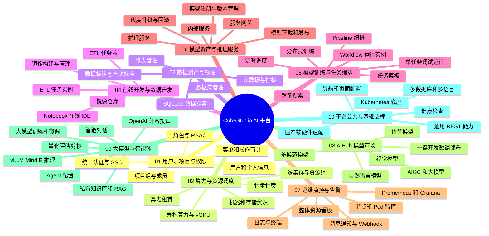

# CubeStudio 一级模块功能接口思维导图

> 整理日期：2026-09-21  
> 整理范围：项目设计说明、业务流程、平台菜单、后端 REST API 与业务动作接口。  
> 主要依据：`README.md`、`myapp/views/home.py`、`myapp/views/baseApi.py`、`myapp/views/view_*.py`。  
> 说明：本文以一级模块规划为主线。接口状态分为“已实现”“规划/集成”“公共 REST”。“规划/集成”表示设计文档或菜单中已出现，但当前仓库未发现对应本地后端实现，或能力由外部系统提供。

## 1. 一级模块总览

## 2. 接口阅读约定

### 2.1 公共 REST 接口

绝大多数资源型模块继承 `MyappModelRestApi`。若具体模块权限允许，则统一具备下列接口。本文各模块只列资源根路径和额外业务动作，避免重复展开。

| 接口 | 方法 | 功能 |
| --- | --- | --- |
| `{资源根路径}/_info` | GET | 获取列表、表单、字段、权限、筛选项和操作配置 |
| `{资源根路径}/` | GET | 分页查询资源列表 |
| `{资源根路径}/{id}` | GET | 查询资源详情 |
| `{资源根路径}/` | POST | 新增资源 |
| `{资源根路径}/{id}` | PUT | 更新资源 |
| `{资源根路径}/{id}` | DELETE | 删除资源 |
| `{资源根路径}/action/{name}/{id}` | GET | 执行单条资源动作 |
| `{资源根路径}/multi_action/{name}` | POST | 执行批量资源动作 |
| `{资源根路径}/upload/` | POST | 批量导入；仅配置导入能力的模块可用 |
| `{资源根路径}/download/` | GET | 批量导出；仅配置导出能力的模块可用 |
| `{资源根路径}/download_template/` | GET | 下载导入模板；仅配置导入能力的模块可用 |
| `{资源根路径}/echart` | GET | 获取图表数据；仅配置图表能力的模块可用 |
| `{资源根路径}/favorite/{id}` | POST / DELETE | 收藏或取消收藏；仅启用收藏的模块可用 |

### 2.2 状态标记

- `[x]`：当前仓库已有实现或已注册入口。
- `[~]`：设计中已规划，需对接外部系统，或菜单已有入口但当前仓库未找到后端实现。
- `[ ]`：建议补充的接口或文档项。

## 3. 一级模块详细清单

### 3.1 用户、项目与权限

#### 模块目标

统一身份接入、租户和项目隔离、人员角色授权，为数据、开发、训练、服务等资源提供访问边界。

#### 功能清单

- [x] SSO 和账号登录：账号密码、OID、LDAP、Remote User 等认证方式。
- [x] 用户管理：用户资料、组织架构、账号状态和个人信息。
- [x] 项目组管理：项目分组、命名空间、集群、资源组、挂载和服务代理配置。
- [x] 项目成员管理：成员加入、成员角色、组内资源使用范围。
- [x] RBAC：用户、角色、菜单、接口和操作权限。
- [x] 操作日志：新增、修改、删除、清理等操作记录。
- [x] 多租户：按公司、组织和项目组隔离资源。
- [~] 强密码、登录频率限制、密码密文传输和统一消息推送，依赖部署配置或外部认证系统。

#### 接口清单

| 子模块 | 资源根路径/接口 | 方法 | 状态 | 说明 |
| --- | --- | --- | --- | --- |
| 用户管理 | `/users/api` | 公共 REST | 已实现 | 用户增删改查与权限控制 |
| 个人信息 | `/userinfo/api/current/userinfo` | GET / POST | 已实现 | 查询或更新当前用户信息 |
| 项目组 | `/project_modelview/api` | 公共 REST | 已实现 | 通用项目组资源接口 |
| 项目分组 | `/project_modelview/org/api` | 公共 REST | 已实现 | 项目空间菜单实际使用入口 |
| 模板分类 | `/project_modelview/job_template/api` | 公共 REST | 已实现 | 任务模板所属功能分类 |
| 项目成员 | `/project_user_modelview/api` | 公共 REST | 已实现 | 项目成员与组内角色配置 |
| 角色管理 | `/roles` | 页面/安全视图 | 已实现 | Flask-AppBuilder 角色管理入口 |
| 操作日志 | `/log_modelview/api` | 公共 REST | 已实现 | 平台操作日志查询和批量删除 |
| 登录认证 | 由 Flask-AppBuilder Security 提供 | 配置驱动 | 已实现 | 具体路由随认证方式与部署配置变化 |

#### 模块依赖

- Kubernetes namespace、集群和资源组配置。
- Flask-AppBuilder Security 与平台自定义权限体系。
- OID、LDAP、OA 等企业身份源。

---

### 3.2 算力与资源调度

#### 模块目标

以 Kubernetes 为统一算力底座，纳管多集群、多资源组、异构芯片、存储资源，并提供租赁、限额和计费能力。

#### 功能清单

- [x] 多 Kubernetes 集群和多资源组调度。
- [x] CPU、GPU、NPU、DCU、MLU 等异构算力选择。
- [x] GPU 独占、共享、vGPU、指定卡序号和 Binpack 调度。
- [x] IB、RoCE、RDMA 高速网络资源透传。
- [x] 项目组、用户、任务多级资源限制。
- [x] Notebook、Pipeline、内部服务、推理服务统一资源申请。
- [x] 节点、Pod、资源组和命名空间使用情况展示。
- [~] 机器资源 Web 配置：调度类型、资源组、RDMA、vGPU 和适用场景。
- [~] 存储资源管理：NFS、CFS、OSS、NAS、COS、GlusterFS、CephFS、S3/MinIO。
- [~] 算力市场、租赁实例、存储租赁、按需/包月/包日租赁。
- [~] 计量计费、日结账单、充值和支付。

#### 接口清单

| 子模块 | 资源根路径/接口 | 方法 | 状态 | 说明 |
| --- | --- | --- | --- | --- |
| 整体资源 | `/total_resource/api` | GET | 已实现 | 资源列表和看板数据 |
| 监控数据 | `/total_resource/api/data` | GET | 已实现 | 暴露聚合资源监控数据 |
| Pod 详情 | `/k8s/read/pod/{cluster}/{namespace}/{pod}` | GET | 已实现 | 查询指定 Pod 信息 |
| Pod 搜索 | `/k8s/web/search/{cluster}/{namespace}/{search}` | GET | 已实现 | 搜索 Pod 和 Service |
| 强制删除 Pod | `/k8s/delete/pod/{cluster}/{namespace}/{pod}` | GET | 已实现 | 清理无法终止的 Pod |
| Terminating Pod | `/k8s/read/pod/terminating[/{namespace}]` | GET | 已实现 | 查询异常终止 Pod |
| 机器资源 | `/node_modelview/api` | 公共 REST | 规划/未发现实现 | 菜单已声明，当前仓库无对应注册类 |
| 存储资源 | `/storage_modelview/api` | 公共 REST | 规划/未发现实现 | 菜单已声明，当前仓库无对应注册类 |
| 算力市场 | 菜单 `compute_leasing` | 页面/服务 | 规划/外部集成 | 当前仓库无明确后端接口 |
| 存储租赁 | `/storageLease` | 前端路由 | 规划/外部集成 | 当前仓库无明确后端接口 |
| 租赁实例 | 菜单 `resource_instance` | 页面/服务 | 规划/外部集成 | 当前仓库无明确后端接口 |
| 计量计费 | `/pod_modelview/api` | 公共 REST | 规划/未发现实现 | 菜单已声明，当前仓库无对应注册类 |
| 账单支付 | `/bill_modelview/api` | 公共 REST | 规划/未发现实现 | 菜单已声明，当前仓库无对应注册类 |
| 充值 | `/recharge` | 前端路由 | 规划/外部集成 | 当前仓库无明确后端接口 |

#### 建议补充接口

- [ ] 统一集群、节点、资源组、存储卷的 OpenAPI 定义。
- [ ] 资源配额查询、校验、冻结、释放接口。
- [ ] 资源价格、租赁订单、用量明细、账单和支付状态接口。
- [ ] GPU/NPU/DCU 设备拓扑和健康状态接口。

---

### 3.3 数据资产与标注

#### 模块目标

打通结构化数据、媒体样本、元数据、指标、维表、数据探索和标注流程，为训练提供可管理、可追溯的数据资产。

#### 功能清单

- [x] SQLLab 多数据源交互查询。
- [x] 元数据库表管理。
- [x] 指标元数据管理。
- [x] 维表定义、在线维护、批量导入导出和 Hive 外表创建。
- [x] 数据集上传、版本、分片、预览、下载和表格探索。
- [~] 图像、文本、音频、多模态标注。
- [~] 标注任务分配、草稿、审核、质量评分和项目权限。
- [~] Label Studio 数据导入 Pipeline、数据集双向同步和 Webhook。
- [~] 视觉模型、大模型自动化标注。

#### 接口清单

| 子模块 | 资源根路径/接口 | 方法 | 状态 | 说明 |
| --- | --- | --- | --- | --- |
| SQLLab 配置 | `/idex/config` | GET / POST | 已实现 | 查询数据库引擎配置 |
| 提交 SQL | `/idex/submit_task` | POST | 已实现 | 创建异步 SQL 查询任务 |
| SQL 状态 | `/idex/look/{task_id}` | GET | 已实现 | 查询任务执行状态 |
| SQL 结果 | `/idex/result/{task_id}` | GET | 已实现 | 获取查询结果 |
| SQL 下载 | `/idex/download_url/{task_id}` | GET | 已实现 | 获取结果下载地址 |
| 停止 SQL | `/idex/stop/{task_id}` | GET | 已实现 | 终止查询任务 |
| 元数据表 | `/metadata_table_modelview/api` | 公共 REST | 已实现 | 库表元数据管理 |
| 指标管理 | `/metadata_metric_modelview/api` | 公共 REST | 已实现 | 指标定义和维护 |
| 维表定义 | `/dimension_table_modelview/api` | 公共 REST | 已实现 | 维表元信息维护 |
| 创建 Hive 外表 | `/dimension_table_modelview/api/create_external_table/{dim_id}` | GET | 已实现 | 根据维表配置创建外表 |
| 动态维表信息 | `/dimension_remote_table_modelview/{dim_id}/api/_info` | GET | 已实现 | 获取某张维表的动态接口定义 |
| 动态维表列表 | `/dimension_remote_table_modelview/{dim_id}/api/` | GET | 已实现 | 查询维表数据 |
| 动态维表新增 | `/dimension_remote_table_modelview/{dim_id}/api/` | POST | 已实现 | 新增维表数据 |
| 动态维表详情 | `/dimension_remote_table_modelview/{dim_id}/api/{pk}` | GET | 已实现 | 查询维表行 |
| 动态维表更新 | `/dimension_remote_table_modelview/{dim_id}/api/{pk}` | PUT | 已实现 | 更新维表行 |
| 动态维表删除 | `/dimension_remote_table_modelview/{dim_id}/api/{pk}` | DELETE | 已实现 | 删除维表行 |
| 维表批量上传 | `/dimension_remote_table_modelview/{dim_id}/api/upload/` | POST | 已实现 | 批量导入维表数据 |
| 维表上传模板 | `/dimension_remote_table_modelview/{dim_id}/api/download_template/` | GET | 已实现 | 下载导入模板 |
| 维表批量下载 | `/dimension_remote_table_modelview/{dim_id}/api/download/` | GET | 已实现 | 导出维表数据 |
| 维表批量动作 | `/dimension_remote_table_modelview/{dim_id}/api/multi_action/{name}` | POST | 已实现 | 执行维表批量操作 |
| 数据集 | `/dataset_modelview/api` | 公共 REST | 已实现 | 数据集元数据和版本管理 |
| 数据集下载 | `/dataset_modelview/api/download/{dataset_id}[/{partition}]` | GET / POST | 已实现 | 下载数据集或指定分片 |
| 数据集预览 | `/dataset_modelview/api/preview/{name}[/{version}[/{segment}]]` | GET / POST | 已实现 | 预览数据集版本或分片 |
| 标注平台 | 菜单 `label_platform` | 外部服务 | 规划/集成 | 当前菜单暂复用元数据地址，标注后端未在本仓库实现 |

#### 建议补充接口

- [ ] 数据血缘、数据质量、数据权限和数据生命周期接口。
- [ ] 标注项目、任务、样本、审核、质检和导入导出 OpenAPI。
- [ ] 自动标注任务提交、进度查询、结果回写和失败重试接口。

---

### 3.4 在线开发与数据开发

#### 模块目标

提供从镜像环境准备、在线 IDE、交互调试到 ETL 编排的浏览器端开发工作台。

#### 功能清单

- [x] 镜像仓库配置和拉取秘钥管理。
- [x] 在线镜像构建、调试、保存和清理。
- [x] Notebook/JupyterLab/VSCode 在线 IDE。
- [x] Notebook CPU、GPU、vGPU、共享卡和异构算力配置。
- [x] Notebook 重置、续期、停止和环境保存。
- [x] Git、SSH Remote、TensorBoard、GPU 监控等开发工具集成。
- [x] ETL Pipeline 配置、模板列表、编排和提交执行。
- [x] ETL 任务与实例管理。
- [~] Airflow、Azkaban、DolphinScheduler 等外部调度引擎适配。

#### 接口清单

| 子模块 | 资源根路径/接口 | 方法 | 状态 | 说明 |
| --- | --- | --- | --- | --- |
| 镜像仓库 | `/repository_modelview/api` | 公共 REST | 已实现 | 仓库与秘钥配置 |
| 镜像管理 | `/images_modelview/api` | 公共 REST | 已实现 | 平台镜像记录管理 |
| 镜像构建 | `/docker_modelview/api` | 公共 REST | 已实现 | 构建任务管理 |
| 镜像调试 | `/docker_modelview/api/debug/{docker_id}` | GET / POST | 已实现 | 启动或进入构建调试容器 |
| 清理调试容器 | `/docker_modelview/api/delete_pod/{docker_id}` | GET / POST | 已实现 | 删除镜像调试 Pod |
| 保存镜像 | `/docker_modelview/api/save/{docker_id}` | GET / POST | 已实现 | 提交调试环境为镜像 |
| 打开镜像调试 | `/docker_modelview/api/entry/docker` | GET / DELETE | 已实现 | 创建或进入镜像调试环境 |
| Notebook | `/notebook_modelview/api` | 公共 REST | 已实现 | 在线 IDE 实例管理 |
| Notebook SDK | `/notebook_modelview/sdk` | 公共 REST | 已实现 | SDK 访问入口 |
| 创建/打开 IDE | `/notebook_modelview/api/entry/jupyter` | GET / DELETE | 已实现 | 创建或打开 Jupyter 环境 |
| IDE 列表 | `/notebook_modelview/api/list/` | GET | 已实现 | 查询当前用户在线 IDE |
| 重置 IDE | `/notebook_modelview/api/reset/{notebook_id}` | GET / POST | 已实现 | 重建在线开发环境 |
| IDE 续期 | `/notebook_modelview/api/renew/{notebook_id}` | GET / POST | 已实现 | 延长环境有效期 |
| 停止 IDE | `/notebook_modelview/api/stop/{notebook_id}` | GET / POST | 已实现 | 停止开发实例 |
| ETL Pipeline | `/etl_pipeline_modelview/api` | 公共 REST | 已实现 | ETL 流程定义管理 |
| ETL 配置 | `/etl_pipeline_modelview/api/config/{etl_pipeline_id}` | GET / POST | 已实现 | 获取 DAG、按钮和公共参数 |
| ETL 模板 | `/etl_pipeline_modelview/api/template/list[/{etl_pipeline_id}]` | GET | 已实现 | 获取通用或流程内模板 |
| 提交 ETL | `/etl_pipeline_modelview/api/submit_etl_pipeline/{etl_pipeline_id}` | GET / POST | 已实现 | 提交 ETL 流程 |
| ETL 编排页 | `/etl_pipeline_modelview/api/web/{etl_pipeline_id}` | GET | 已实现 | 打开 ETL 可视化编排 |
| ETL 任务 | `/etl_task_modelview/api` | 公共 REST | 已实现 | ETL 任务定义/实例管理 |

---

### 3.5 模型训练与任务编排

#### 模块目标

通过模板化算子和拖拽式 DAG，将数据处理、训练、评估、注册和部署串成可调试、可调度、可监控的训练流水线。

#### 功能清单

- [x] 任务模板分类、注册、复制和复用。
- [x] 单任务创建、调试、运行、日志查看和清理。
- [x] Pipeline 创建、复制、导入导出和拖拽编排。
- [x] Pipeline 运行、任务依赖、全局参数和输入输出。
- [x] 定时调度、补录、并发限制、超时和实例依赖。
- [x] Workflow 实例、DAG、节点详情、日志和停止。
- [x] CPU/GPU/NPU、卡型、vGPU 和 RDMA 训练资源配置。
- [x] TensorFlow、PyTorch、Ray、Volcano、MPI、DeepSpeed 等训练框架模板。
- [x] NNI 单机/分布式超参搜索。
- [x] 文本、图片、CSV、JSON、表格和 ECharts 结果可视化。

#### 接口清单

| 子模块 | 资源根路径/接口 | 方法 | 状态 | 说明 |
| --- | --- | --- | --- | --- |
| 任务模板 | `/job_template_modelview/api` | 公共 REST | 已实现 | 通用模板管理接口 |
| 任务模板页面 | `/job_template_fab_modelview/api` | 公共 REST | 已实现 | 菜单实际使用入口 |
| 单任务 | `/task_modelview/api` | 公共 REST | 已实现 | Pipeline 节点任务管理 |
| 任务调试 | `/task_modelview/api/debug/{task_id}` | GET / POST | 已实现 | 启动单任务调试 |
| 任务运行 | `/task_modelview/api/run/{task_id}` | GET / POST | 已实现 | 执行单任务 |
| 任务清理 | `/task_modelview/api/clear/{task_id}` | GET / POST | 已实现 | 清理运行资源 |
| 任务日志 | `/task_modelview/api/log/{task_id}` | GET / POST | 已实现 | 查看任务日志 |
| Pipeline | `/pipeline_modelview/api` | 公共 REST | 已实现 | 流水线定义管理 |
| 首页 Pipeline | `/pipeline_modelview/home/api` | 公共 REST | 已实现 | 首页简化入口 |
| 我的 Pipeline | `/pipeline_modelview/api/my/list/` | GET | 已实现 | 查询当前用户流程 |
| 示例 Pipeline | `/pipeline_modelview/api/demo/list/` | GET | 已实现 | 查询示例流程 |
| 运行 Pipeline | `/pipeline_modelview/api/run_pipeline/{pipeline_id}` | GET / POST | 已实现 | 编译并提交流程 |
| Pipeline 编排 | `/pipeline_modelview/api/web/{pipeline_id}` | GET | 已实现 | 打开拖拽编排页 |
| Pipeline 日志 | `/pipeline_modelview/api/web/log/{pipeline_id}` | GET | 已实现 | 打开调试跟踪 |
| Pipeline 监控 | `/pipeline_modelview/api/web/monitoring/{pipeline_id}` | GET | 已实现 | 打开资源监控 |
| Pipeline Pod | `/pipeline_modelview/api/web/pod/{pipeline_id}` | GET | 已实现 | 查看运行 Pod |
| Pipeline 调度记录 | `/pipeline_modelview/api/web/runhistory/{pipeline_id}` | GET | 已实现 | 查看定时运行记录 |
| Pipeline Workflow | `/pipeline_modelview/api/web/workflow/{pipeline_id}` | GET | 已实现 | 查看工作流实例 |
| 复制 Pipeline | `/pipeline_modelview/api/copy_pipeline/{pipeline_id}` | GET / POST | 已实现 | 复制流程及节点 |
| 定时调度 | `/runhistory_modelview/api` | 公共 REST | 已实现 | Pipeline 定时任务记录 |
| Workflow | `/workflow_modelview/api` | 公共 REST | 已实现 | 工作流运行实例管理 |
| 停止 Workflow | `/workflow_modelview/api/stop/{crd_id}` | GET | 已实现 | 停止工作流实例 |
| Workflow DAG | `/workflow_modelview/api/web/dag/{cluster}/{namespace}/{workflow}` | GET | 已实现 | 查询实例 DAG |
| Workflow 布局 | `/workflow_modelview/api/web/layout/{cluster}/{namespace}/{workflow}` | GET | 已实现 | 查询运行进度布局 |
| 节点详情 | `/workflow_modelview/api/web/node_detail/{cluster}/{namespace}/{workflow}/{node}` | GET | 已实现 | 查询任务节点详情 |
| 节点日志 | `/workflow_modelview/api/web/log/{cluster}/{namespace}/{workflow}/{pod}[/{file}]` | GET | 已实现 | 查询节点产物或日志 |
| 超参搜索 | `/nni_modelview/api` | 公共 REST | 已实现 | NNI 实验配置管理 |
| 启动超参搜索 | `/nni_modelview/api/run/{nni_id}` | GET / POST | 已实现 | 启动实验 |
| 停止超参搜索 | `/nni_modelview/api/stop/{nni_id}` | GET / POST | 已实现 | 停止实验 |
| 超参日志 | `/nni_modelview/api/log/{nni_id}` | GET / POST | 已实现 | 查看实验 Pod 日志 |
| 超参页面 | `/nni_modelview/api/web/{nni_id}` | GET / POST | 已实现 | 打开 NNI 实验界面 |

---

### 3.6 模型资产与推理服务

#### 模块目标

统一管理训练模型及其版本、指标和文件，将模型发布到调试、测试、生产环境，并提供流量治理、弹性伸缩和服务监控。

#### 功能清单

- [x] 模型注册、版本管理、指标展示和模型下载。
- [x] 模型一键转推理服务。
- [x] ML、TensorFlow、PyTorch、TensorRT、ONNX、Triton、LLM 等模型发布配置。
- [x] 调试、测试、生产环境部署。
- [x] CPU、内存、GPU、vGPU 和卡型配置。
- [x] 域名、端口、启动命令、环境变量、配置挂载和健康检查。
- [x] 随机/Header 分流、限流、流量复制、Sidecar 和服务优先级。
- [x] 多版本升级、回滚、定时伸缩和 JWT 认证配置。
- [x] MySQL Web、Redis Web、Neo4j、RStudio、Ollama、Xinference 等内部服务。
- [~] 服务网关统一入口、Token 密钥、QPS/TPS 限速和黑白名单。

#### 接口清单

| 子模块 | 资源根路径/接口 | 方法 | 状态 | 说明 |
| --- | --- | --- | --- | --- |
| 模型管理页面 | `/training_model_modelview/web/api` | 公共 REST | 已实现 | 模型列表与管理页面入口 |
| 模型管理 API | `/training_model_modelview/api` | 公共 REST | 已实现 | 模型资产管理接口 |
| 下载模型 | `/training_model_modelview/api/download/{model_id}` | GET / POST | 已实现 | 下载模型文件 |
| 部署模型 | `/training_model_modelview/api/deploy/{model_id}` | GET / POST | 已实现 | 转换为推理服务配置 |
| 内部服务 | `/service_modelview/api` | 公共 REST | 已实现 | 内部工具服务配置 |
| 部署内部服务 | `/service_modelview/api/deploy/{service_id}` | GET / POST | 已实现 | 部署内部服务 |
| 清理内部服务 | `/service_modelview/api/clear/{service_id}` | GET / POST | 已实现 | 删除内部服务资源 |
| 推理服务 | `/inferenceservice_modelview/api` | 公共 REST | 已实现 | 推理服务配置和版本管理 |
| 部署调试环境 | `/inferenceservice_modelview/api/deploy/debug/{service_id}` | GET / POST | 已实现 | 部署调试服务 |
| 部署测试环境 | `/inferenceservice_modelview/api/deploy/test/{service_id}` | GET / POST | 已实现 | 部署测试服务 |
| 部署生产环境 | `/inferenceservice_modelview/api/deploy/prod/{service_id}` | GET / POST | 已实现 | 部署生产服务 |
| 升级服务 | `/inferenceservice_modelview/api/deploy/update/` | GET / POST | 已实现 | 更新服务版本和流量配置 |
| 清理推理服务 | `/inferenceservice_modelview/api/clear/{service_id}` | GET / POST | 已实现 | 删除服务资源 |
| 服务网关 | `/llm/api` | 公共 REST | 规划/未发现实现 | 菜单已声明，当前仓库无注册类 |

#### 建议补充接口

- [ ] 模型评测报告、模型签名、审批、上下线和归档接口。
- [ ] 推理服务版本、流量规则、回滚记录和发布审计接口。
- [ ] 网关密钥、额度、速率限制、路由、重试和用量统计接口。
- [ ] 标准 OpenAPI/SDK 文档及在线调试页。

---

### 3.7 运维监控与告警

#### 模块目标

覆盖集群、节点、Pod、训练任务、推理服务和网关流量，提供日志、终端、监控指标、告警和通知闭环。

#### 功能清单

- [x] 集群、节点、Pod 的 CPU、内存、GPU 和网络资源看板。
- [x] 推理服务 QPS、吞吐和 vGPU 负载监控设计。
- [x] Pod 日志查看、下载和命令行终端。
- [x] Workflow 任务耗时、状态和节点日志。
- [x] Prometheus/Grafana 监控集成。
- [~] IB 流量、NPU、存储和成本监控。
- [~] 邮件、企业微信、钉钉、飞书通知和统一 Webhook。
- [~] 告警规则、告警记录、静默和恢复闭环接口。

#### 接口清单

| 子模块 | 接口 | 方法 | 状态 | 说明 |
| --- | --- | --- | --- | --- |
| 整体资源 | `/total_resource/api` | GET | 已实现 | 聚合资源列表 |
| 资源图表 | `/total_resource/api/echart` | GET | 已实现 | 公共 Form API 图表入口 |
| 资源数据 | `/total_resource/api/data` | GET | 已实现 | 资源监控数据 |
| 实时日志 | `/k8s/watch/log/{cluster}/{namespace}/{pod}/{container}` | GET | 已实现 | 打开流式日志界面 |
| 远程终端 | `/k8s/watch/exec/{cluster}/{namespace}/{pod}/{container}` | GET | 已实现 | 打开 Pod 命令行 |
| 下载日志 | `/k8s/download/log/{cluster}/{namespace}/{pod}` | GET | 已实现 | 下载 Pod 日志 |
| 读取日志 | `/k8s/read/log/{cluster}/{namespace}/{pod}[/{container}[/{tail}]]` | GET | 已实现 | 返回日志内容 |
| Pod 页面 | `/k8s/web/pod/{cluster}/{namespace}/{pod}` | GET / POST | 已实现 | 打开 Pod 详情 |
| Pod 日志页 | `/k8s/web/log/{cluster}/{namespace}/{pod}[/{container}]` | GET | 已实现 | 打开日志页面 |
| Pod 终端页 | `/k8s/web/debug/{cluster}/{namespace}/{pod}[/{container}]` | GET / POST | 已实现 | 打开调试终端 |
| 操作日志 | `/log_modelview/api` | 公共 REST | 已实现 | 平台审计日志 |
| 告警管理 | 未形成独立资源接口 | - | 规划/待补充 | 当前主要由任务状态和部署配置触发通知 |

---

### 3.8 AIHub 模型市场

#### 模块目标

沉淀视觉、语音、自然语言、多模态和大模型应用资产，为用户提供体验、API、一键开发、一键微调和一键部署。

#### 功能清单

- [x] 模型应用按视觉、语音、自然语言、多模态和 AIGC 分类展示。
- [x] AIHub 应用元数据、镜像、启动命令和资源配置管理。
- [x] Web 体验和 API 推理入口设计。
- [x] 一键转 Notebook 开发。
- [x] 一键转 Pipeline 微调和部署链路设计。
- [x] AIHub 应用与 Pipeline 算子互调设计。
- [~] 400+ 预训练模型资产取决于初始化数据和部署版本。
- [~] Label Studio 自动标注和移动端 Web 应用属于跨系统集成。

#### 接口清单

| 分类 | 资源根路径 | 方法 | 状态 | 说明 |
| --- | --- | --- | --- | --- |
| 视觉 | `/model_market/visual/api` | 公共 REST | 已实现 | 视觉模型应用列表 |
| 语音 | `/model_market/voice/api` | 公共 REST | 已实现 | 语音模型应用列表 |
| 自然语言 | `/model_market/language/api` | 公共 REST | 已实现 | NLP 模型应用列表 |
| 多模态 | `/model_market/multimodal/api` | 公共 REST | 已实现 | 多模态模型应用列表 |
| AIGC/大模型 | `/model_market/aigc/api` | 公共 REST | 已实现 | AIGC 模型应用列表 |
| 全部模型 | `/model_market/all/api` | 公共 REST | 已实现 | 全分类模型应用查询 |
| 应用推理 API | 由具体 AIHub 应用提供 | 应用自定义 | 规划/实例化 | 接口协议由应用 SDK 和部署配置决定 |

#### 建议补充接口

- [ ] 应用详情、版本、评价、收藏、发布审核和下架接口。
- [ ] 一键开发、微调、部署的异步任务和进度查询接口。
- [ ] 统一应用推理协议、鉴权、配额和调用样例。

---

### 3.9 大模型与智能体

#### 模块目标

覆盖大模型数据准备、分布式训练、微调、量化评估、推理部署、知识库、智能对话和 Agent 应用。

#### 功能清单

- [x] DeepSpeed、Megatron、ColossalAI、Horovod、MPI 等分布式训练模板。
- [x] DeepSeek、ChatGLM、Qwen、LLaMA 等 Full/LoRA 微调设计。
- [x] LLaMA-Factory SFT、奖励模型和强化学习训练设计。
- [x] 大模型量化、评估和剪枝设计。
- [x] vLLM、MindIE、Ollama、Xinference 推理部署设计。
- [x] 智能对话场景、提示词模板、模型接口、会话历史和多模态输入。
- [x] 私有知识库上传、文本切分、Embedding、召回、排序和引用展示。
- [x] OpenAI 风格对话接口。
- [~] Agent 插件配置、网关、Token 中转和完整 LLMOps 能力在当前仓库中不完整。

#### 接口清单

| 子模块 | 接口 | 方法 | 状态 | 说明 |
| --- | --- | --- | --- | --- |
| 对话场景 | `/chat_modelview/api` | 公共 REST | 已实现 | 场景、提示词、模型和知识库配置 |
| 对话智能体 | `/chat_modelview/api/chat/{chat_name}` | GET / POST | 已实现 | 按场景执行智能对话 |
| OpenAI 风格对话 | `/chat_modelview/api/chat/chatgpt/{chat_name}` | GET / POST | 已实现 | ChatGPT/OpenAI 风格响应接口 |
| 清理会话缓存 | `/chat_modelview/api/clear/{session_id}` | GET / DELETE | 已实现 | 清除指定会话上下文 |
| 对话别名 API | `/aitalk_modelview/api` | 公共 REST | 已实现 | 另一组智能对话资源入口 |
| AIHub 大模型 | `/model_market/aigc/api` | 公共 REST | 已实现 | 大模型应用市场入口 |
| 推理服务 | `/inferenceservice_modelview/api` | 公共 REST | 已实现 | vLLM/MindIE 等服务实例承载 |
| Agent 配置 | `/chat_plugin_modelview/api` | 公共 REST | 规划/未发现实现 | 菜单已声明，当前仓库无注册类 |
| 大模型网关 | `/llm/api` | 公共 REST | 规划/未发现实现 | 菜单已声明，当前仓库无注册类 |

#### 建议补充接口

- [ ] 知识库、文件、分片、向量索引、检索测试和重建索引接口。
- [ ] Prompt、工具、Agent、工作流、记忆和会话反馈接口。
- [ ] 模型供应商、模型路由、密钥、Token 额度和用量账单接口。
- [ ] OpenAI `/v1/chat/completions`、`/v1/embeddings`、`/v1/models` 兼容层文档。

---

### 3.10 平台公共与基础支撑

#### 模块目标

为所有一级业务模块提供导航、通用 REST、健康检查、基础设施、网络、数据库、国际化和国产化适配。

#### 功能清单

- [x] 平台顶部、左侧、底部导航和菜单配置。
- [x] 通用列表、详情、表单、批量动作、导入导出、图表和收藏能力。
- [x] Kubernetes 容器化部署和多集群适配。
- [x] MySQL、PostgreSQL、OceanBase、人大金仓、达梦等元数据库适配设计。
- [x] 多语言国际化配置。
- [x] x86/ARM、昇腾、海光、寒武纪、沐曦、摩尔线程、昆仑芯等国产化适配设计。
- [x] HTTP/HTTPS、域名、反向代理和内网穿透部署能力。
- [x] 平台健康检查。

#### 接口清单

| 子模块 | 接口 | 方法 | 状态 | 说明 |
| --- | --- | --- | --- | --- |
| 健康检查 | `/health` | GET | 已实现 | 返回 `OK` |
| 健康检查 | `/healthcheck` | GET | 已实现 | 返回 `OK` |
| Ping | `/ping` | GET | 已实现 | 返回 `OK` |
| 顶部导航 | `/myapp/navbar_right` | GET | 已实现 | 返回顶部右侧导航配置 |
| 左侧导航 | `/myapp/navbar_left` | GET | 已实现 | 返回平台一级/二级菜单 |
| 底部助手 | `/myapp/navbar_bottom` | GET | 已实现 | 返回智能助手入口配置 |
| 子菜单 | `/myapp/menu` | GET | 已实现 | 返回顶部菜单和侧边子菜单 |
| 页面弹窗 | `/myapp/feature/check` | GET | 已实现 | 根据页面路由返回提示配置 |

## 4. 跨模块业务链路

### 链路接口对应

1. 用户和项目：`/users/api`、`/project_modelview/api`、`/project_user_modelview/api`。
2. 数据准备：`/idex/*`、`/metadata_*`、`/dimension_*`、`/dataset_modelview/api`。
3. 开发环境：`/repository_modelview/api`、`/docker_modelview/api`、`/notebook_modelview/api`。
4. 训练编排：`/job_template_*`、`/task_modelview/api`、`/pipeline_modelview/api`、`/workflow_modelview/api`、`/nni_modelview/api`。
5. 模型和服务：`/training_model_modelview/api`、`/service_modelview/api`、`/inferenceservice_modelview/api`。
6. 应用交付：`/model_market/*/api`、`/chat_modelview/api`，以及规划中的 `/llm/api`。
7. 运维闭环：`/total_resource/api`、`/k8s/*`、`/log_modelview/api`。

## 5. 接口建设优先级建议

### P0：补齐平台核心闭环

- [ ] 为算力资源、节点、存储、配额建立正式 REST API，不再只依赖部署配置和 K8s 工具接口。
- [ ] 为服务网关 `/llm/api` 补齐密钥、限流、路由、用量、黑白名单和监控接口。
- [ ] 为数据标注建立独立模块接口，明确与 Label Studio、数据集、Pipeline 的边界。
- [ ] 为知识库建立独立资源模型和文件、分片、索引、检索接口。

### P1：提升可运营性

- [ ] 建立计量、价格、租赁订单、账单、充值和支付接口。
- [ ] 建立告警规则、告警事件、通知渠道、静默和恢复接口。
- [ ] 建立模型审批、发布记录、流量规则、回滚记录和服务 SLA 接口。
- [ ] 建立 AIHub 应用发布、审核、版本、评价和调用统计接口。

### P2：统一开放能力

- [ ] 为所有一级模块补充 OpenAPI 3.0 文档和统一错误码。
- [ ] 统一分页、筛选、排序、异步任务、幂等键和审计字段规范。
- [ ] 提供 Python/Java/JavaScript SDK 与可运行调用示例。
- [ ] 区分页面跳转接口、内部管理接口和对外开放接口。
- [ ] 为高风险动作补充审批、权限校验和操作审计。

## 6. 一级模块与源码映射

| 一级模块 | 主要设计/入口文件 |
| --- | --- |
| 用户、项目与权限 | `myapp/views/view_user_role.py`、`view_team.py`、`view_log.py`、`myapp/security.py` |
| 算力与资源调度 | `myapp/views/view_total_resource.py`、`view_k8s.py`、`myapp/utils/py/py_k8s.py` |
| 数据资产与标注 | `view_sqllab.py`、`view_metadata.py`、`view_metadata_metric.py`、`view_dimension.py`、`view_dataset.py` |
| 在线开发与数据开发 | `view_images.py`、`view_docker.py`、`view_notebook.py`、`view_etl_pipeline.py` |
| 模型训练与任务编排 | `view_job_template.py`、`view_task.py`、`view_pipeline.py`、`view_runhistory.py`、`view_workflow.py`、`view_nni.py` |
| 模型资产与推理服务 | `view_train_model.py`、`view_serving.py`、`view_inferenceserving.py` |
| 运维监控与告警 | `view_total_resource.py`、`view_k8s.py`、`view_workflow.py`、`view_log.py` |
| AIHub 模型市场 | `view_aihub.py`、`myapp/init/init-aihub.json` |
| 大模型与智能体 | `view_chat.py`、`view_inferenceserving.py`、`view_aihub.py` |
| 平台公共与基础支撑 | `README.md`、`view/home.py`、`view/route.py`、`baseApi.py`、`baseFormApi.py` |

## 7. 结论性清单

- [x] 当前一级模块已覆盖 AI 平台从用户、资源、数据、开发、训练、模型、服务、监控到 AI 应用的主链路。
- [x] 资源型模块已形成统一 REST 访问模式，主要业务动作通过扩展接口提供。
- [x] 训练 Pipeline、Workflow、推理服务和智能对话是当前仓库接口最完整的核心模块。
- [~] 算力租赁、计量计费、服务网关、Agent 插件、机器/存储管理在设计和菜单中已有位置，但当前仓库未形成完整本地实现。
- [~] 数据标注依赖外部平台集成，当前仓库缺少独立的标注领域 API。
- [ ] 下一阶段应优先补齐资源、网关、标注和知识库四组 API，并统一输出 OpenAPI 文档。
