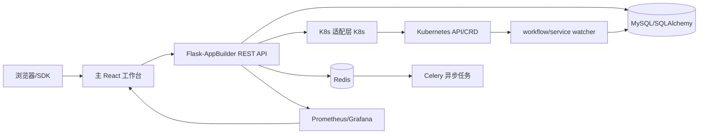
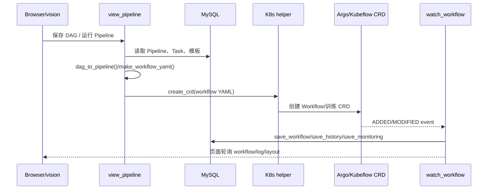

# Cube Studio 代码分析报告

> 分析范围：当前工作区全部业务代码、部署清单、任务模板和三个前端工程。报告以代码静态阅读为主，结论反映仓库结构与调用关系，不等同于已经在真实 Kubernetes 集群上完成的运行验收。

## 1. 结论摘要

Cube Studio 是一个以 Flask-AppBuilder 为管理平面、SQLAlchemy 为元数据层、Kubernetes 为执行平面的 MLOps 平台。代码采用“后端模型驱动的通用 REST + 前端动态菜单/表单”的实现方式：后端视图从模型和配置派生字段、权限及动作描述，主前端通过 `/myapp/menu` 获取菜单，再把菜单项映射为通用页面；Pipeline/ETL 则由独立 React 编排器负责图形化编辑。

系统的主要执行链是：

代码的长处是业务覆盖广、Kubernetes 资源抽象集中、前端元数据驱动程度高。主要结构性风险是：视图层承担了大量领域编排和 HTML 拼接；`config.py`/`project.py` 依赖外部部署注入；K8s、数据库、缓存和外部模型调用缺少清晰的端口/服务层隔离；任务监听与定时任务存在独立进程、Celery、Web 进程三种生命周期，部署时必须严格对齐。

## 2. 仓库分层与启动方式

### 2.1 代码分层

| 层 | 目录 | 作用 | 关键依赖 |
| --- | --- | --- | --- |
| 启动/配置 | `myapp/__init__.py`、`myapp/security.py`、`install/*/config.py` | 创建 Flask、FAB、数据库、缓存、认证和中间件 | Flask、FAB、SQLAlchemy、Redis |
| 数据模型 | `myapp/models/` | 项目、任务、Pipeline、Notebook、服务、数据集、AIHub 等元数据 | SQLAlchemy/FAB Model |
| API/页面后端 | `myapp/views/` | REST CRUD、动作接口、日志/终端/下载/部署等业务接口 | `baseApi.py`、`base.py`、K8s/Prometheus |
| 执行适配 | `myapp/utils/py/`、`myapp/utils/sqllab/` | K8s、Prometheus、网络、SQLLab 和资源转换 | Kubernetes client、HTTP、数据库驱动 |
| 异步和监听 | `myapp/tasks/`、`myapp/tools/` | Celery 任务、定时清理、CRD/pod watch、状态落库和告警 | Celery、Redis、K8s watch |
| 主前端 | `myapp/frontend/` | 登录后的平台壳、动态菜单、通用表格/表单、首页和数据页面 | React 17、Ant Design、Axios |
| Pipeline 编排器 | `myapp/vision/` | 训练 Pipeline 图形化编辑 | React、Redux Toolkit、G6/Flow 生态 |
| ETL 编排器 | `myapp/visionPlus/` | ETL Pipeline 图形化编辑，结构与 vision 高度相似 | React、Redux Toolkit |
| 任务模板 | `job-template/job/` | 运行在 K8s Pod 中的数据处理、训练、推理、模型注册镜像和启动脚本 | Docker、Python、框架运行时 |
| 基础设施 | `install/docker/`、`install/kubernetes/` | MySQL、Redis、K8s、Argo、Istio、Prometheus、Grafana、存储和 RBAC | Docker Compose/Kustomize/YAML |

### 2.2 启动流程

1. `myapp/__init__.py` 创建 Flask，读取 `MYAPP_CONFIG` 指向的配置模块，初始化 SQLAlchemy、Migrate、缓存、CORS、压缩和 HTTP 中间件。
2. 在 app context 内创建 `AppBuilder`，挂载 `MyappSecurityManager`。
3. `myapp/views/__init__.py` 导入所有视图模块；模块导入时执行 `appbuilder.add_api()`，因此 API 注册具有导入副作用。
4. `install/docker/entrypoint.sh` 执行数据库初始化、迁移、创建 admin、`myapp init`，开发模式启动 `python myapp/run.py`，生产模式使用 Gunicorn/gevent。
5. `supervisord.conf` 可额外启动 `watch_workflow.py` 和 `watch_service.py`；Celery worker/beat 在 Compose 中默认被注释，需要由部署侧单独启用。

`myapp/config.py` 和 `myapp/project.py` 在仓库中为空文件，实际运行依赖 `install/docker` 或 Kustomize overlay 挂载的同名文件。这是部署架构的重要前提：直接在源码目录运行 `myapp` 并不能得到完整平台配置。

## 3. 平台启动、认证与权限

### 3.1 Flask/FAB 壳层

`myapp/__init__.py` 只负责应用和基础设施初始化，首页 `MyIndexView.index()` 将登录用户重定向到 `/frontend/`。`before_request` 中的 `check_login()` 允许静态、登录、健康检查和少数回调路径匿名访问，其余请求要求 Flask-Login 用户或 `Authorization` 头认证。

认证支持三条路径：

- FAB 数据库账号密码登录，逻辑位于 `security.py` 的 `Myauthdbview`。
- Cookie/Flask-Login，会话用户由 `MyappSecurityManager.before_request()` 写入 `g.user`。
- `Authorization` 头：短值可按用户名直连（受 `AUTH_PLATFORM_ACCESS` 或内部域名条件控制），两段 JWT 会补 HS256 header 后验签。

`MyUser` 扩展了 FAB 用户表，加入组织、配额、余额、联系方式等字段；`Project_User` 以项目成员角色（`dev/ops/creator`）补充项目级多租户隔离。各业务视图通常通过 `MyappFilter`、`check_ownership()` 和项目关系过滤数据。

### 3.2 通用 API 协议

`myapp/views/baseApi.py` 的 `MyappModelRestApi` 扩展 FAB `ModelRestApi`，统一提供：

- CRUD、分页、Rison/JSON 查询参数解析和安全异常包装；
- `pre_add/pre_update/pre_delete` 等生命周期钩子；
- `api_info` 元数据接口，返回列、字段组件、校验器、动作、权限和路由信息；
- 通过 `merge_response_func` 添加宽度、关联字段、收藏、导入/下载、图表等前端配置。

`baseFormApi.py` 的 `MyappFormRestApi` 用于不直接依赖 SQLAInterface 的资源看板类接口，例如整体资源监控。`base.py` 提供响应、过滤器、权限检查、YAML 导出和删除混入类。三个基类共同构成了平台的“后端声明模型 -> 前端通用页面”协议。

## 4. 数据模型模块

### 4.1 组织、用户与资源边界

- `model_team.py`：`Project` 保存项目组的集群、命名空间、节点选择、挂载和资源组等扩展 JSON；`Project_User` 建立用户与项目组多对多关系，并保存项目内角色、配额和组织。
- `security.py`：`MyUser`/`MyRole` 映射 FAB 的 `ab_user`/`ab_role`，角色和菜单权限由 FAB 统一管理。
- `model_job.py` 中的 `Repository`、`Images`、`Job_Template` 建立镜像仓库 -> 镜像 -> 任务模板链路。

多数业务表使用 `AuditMixinNullable` 保存创建者/修改者和时间，扩展配置普遍使用 Text 字段存 JSON。这让数据库迁移成本低、模板扩展灵活，但也把字段约束、查询索引和版本兼容交给应用代码。

### 4.2 训练与任务模型

- `Pipeline`：保存 DAG JSON、调度策略、资源选择、Workflow YAML、Argo id/run id、并发/过期策略和告警配置。
- `Task`：属于 Pipeline，关联 `Job_Template`，保存命令、参数、挂载、节点选择、CPU/GPU/RDMA、超时、重试、输出和监控配置。
- `RunHistory`：保存每次调度的 pipeline 文件、版本、run id、实验 id、执行日期和状态。
- `Workflow` + `Crd`：将 Kubernetes CRD 的 metadata/spec/status 规整为数据库记录，承接 Argo/Kubeflow/Volcano/Spark 等多种工作负载。
- `NNI`：保存超参搜索实验配置、trial 参数和实验状态。
- `Training_Model`：保存模型名称、版本、路径、指标、Pipeline 关系和部署信息，作为模型注册到推理服务之间的中间层。

Pipeline 的 `dag_json` 是前端图形布局和后端依赖的共同来源；`fix_dag_json()` 用真实 Task 修正空或不完整 DAG，`sort()` 按上游依赖进行拓扑排序。运行时生成的 Workflow YAML 将 Task 模板、全局环境、挂载和资源翻译成 K8s/Argo 资源。

### 4.3 在线开发、数据和元数据

- `Notebook`：保存 IDE 类型、镜像、命名空间、资源、挂载和扩展状态；状态属性通过 K8s 查询 Pod，并把 Pod IP 写回扩展 JSON。
- `Docker`：描述在线镜像构建/调试任务；Repository、Images、Docker 三个模型组合成仓库管理、镜像定义和构建实例。
- `Dataset`：保存数据集版本、分片、路径、下载地址、特征和指标；视图层按名称把旧版本折叠到最新版本的 `children` 中。
- `Dimension_table`、`Metadata_table`、`Metadata_metric`：分别覆盖维表、库表元数据和指标定义，部分数据从外部 SQL/Hive 元数据源同步。
- `Sqllab_Query`：保存 SQLLab 查询任务和结果引用，实际执行由 `utils/sqllab/base_impl.py` 的引擎实现负责。

### 4.4 服务、AIHub 与对话

- `Service`：通用内部服务，描述镜像、命令、资源、端口、挂载、域名和副本。
- `InferenceService`：在 `Service` 基础上增加模型/版本、模型路径、推理配置、健康检查、指标、HPA、灰度/影子流量和部署历史。
- `Aihub`：模型市场卡片及其数据集、Notebook、任务模板、Pipeline、推理配置。
- `Chat`/`ChatLog`：保存对话场景、提示词、知识库配置、LLM 服务地址/令牌和会话日志。

## 5. 后端业务视图模块

所有视图在 `myapp/views/__init__.py` 被导入，并在模块末尾注册到 AppBuilder。以下路径是主要 API 入口：

| 业务模块 | 入口文件/路由 | 核心逻辑 |
| --- | --- | --- |
| 平台首页/菜单 | `home.py`，`/myapp/menu`、`/myapp/navbar_*` | 根据当前用户和配置生成菜单、头部链接、智能助手和首页提醒 |
| 项目/成员 | `view_team.py`，`/project_modelview/*` | 项目组过滤、成员角色、命名空间/集群/资源组绑定和删除保护 |
| 镜像仓库/模板 | `view_images.py`、`view_job_template.py` | Repository/Images/Job_Template CRUD；模板参数是任务渲染的源数据 |
| Notebook | `view_notebook.py`，`/notebook_modelview/api` | 创建、重置、续期、删除 Notebook；调用 `K8s.make_pod/create_*`，异步检查镜像提交 |
| 在线镜像 | `view_docker.py`，`/docker_modelview/api` | 创建 debug Pod，挂载 Docker/Containerd socket，保存镜像并异步检查 commit |
| 训练 Task | `view_task.py`，`/task_modelview/api` | 校验资源/命令/模板，debug 或 run Pod，读取日志，清理任务；Pipeline 任务可以直接生成或调试 Pod |
| Pipeline | `view_pipeline.py`，`/pipeline_modelview/api` | 读写 DAG，生成 Workflow YAML，复制、运行、查看日志/监控/Pod/run history |
| Workflow | `view_workflow.py`，`/workflow_modelview/api` | 从持久化 CRD 记录展示状态、DAG、节点详情和日志，支持停止 Workflow |
| NNI | `view_nni.py`，`/nni_modelview/api` | 生成 NNI Experiment，控制超参搜索生命周期并映射 Trial 状态 |
| ETL | `view_etl_pipeline.py` 及 Airflow/Azkaban/DolphinScheduler 适配器 | 保存 ETL DAG 和任务模板；外部调度器适配器负责跳转和提交信息，实际调度依赖外部系统 |
| 数据集 | `view_dataset.py`，`/dataset_modelview/api` | 上传/下载/预览/分片，版本折叠和本地数据目录清理 |
| 元数据/维表/SQLLab | `view_metadata.py`、`view_dimension.py`、`view_metadata_metric.py`、`view_sqllab.py` | 外部库表同步、DDL、维表批量导入导出、SQL 异步提交/查询/下载/停止 |
| 内部服务 | `view_serving.py`，`/service_modelview/api` | 生成 Deployment/Service/Ingress，部署、清理和状态检查 |
| 推理服务 | `view_inferenceserving.py`，`/inferenceservice_modelview/api` | 模型服务环境替换、ConfigMap、Deployment/Service/Ingress/HPA、debug/test/prod 和灰度/影子流量 |
| 模型注册 | `view_train_model.py`，`/training_model_modelview/api` | 模型下载、注册和部署入口，连接训练产物与推理服务 |
| AIHub | `view_aihub.py`，`/model_market/*/api` | 按视觉/语音/语言/多模态/AIGC 分类的卡片式模型市场 |
| 对话 | `view_chat.py`，`/aitalk_modelview/api` 和 `/chat/chatgpt/*` | LLM 配置、提示词/知识召回、流式 SSE、历史缓存和 ChatLog |
| 资源监控 | `view_total_resource.py`，`/total_resource_modelview/api` | K8s/Prometheus 资源聚合、ECharts 数据和批量清理 |
| K8s 终端/日志 | `view_k8s.py`，`/k8s/*` | Pod 搜索、日志下载/流式读取、exec、终端和 terminating Pod 清理 |

## 6. 关键业务流程

### 6.1 Pipeline 运行

`view_pipeline.py` 负责从数据库模型生成 Workflow；`py_k8s.py` 只负责 Kubernetes API 调用；`watch_workflow.py` 监听 CRD，再把状态、资源、耗时、历史和告警写回 `Workflow/RunHistory`。这使 Web 请求不必等待训练完成，但也要求 watcher 长期在线且与集群连接正确。

### 6.2 Notebook/Debug Pod

Notebook、Task debug、Docker debug 共用 `K8s.make_pod()`/`create_debug_pod()` 这一类构造器。视图层把项目组的集群/命名空间、用户目录、镜像、资源、节点选择和挂载拼成 Pod spec；之后页面通过 `view_k8s.py` 读取日志、exec 或终端。异步任务负责镜像 commit、Notebook 续期/清理和资源刷新。

### 6.3 推理服务部署

`view_inferenceserving.py` 的 `deploy()` 先解析模型路径和用户变量，再创建 ConfigMap、Deployment、Service、Istio VirtualService/HPA，并将环境变量注入 Pod。debug/test 会加环境名前缀和临时命令，prod 使用真实命令；清理时按名称和标签删除相关资源。服务访问地址由项目组/集群/全局 external IP 和域名配置共同计算。

### 6.4 对话与知识库

`view_chat.py` 解析 Chat 的 JSON 配置，选择 LLM URL/token，按提示词模板插入问题、历史和知识片段，然后调用 OpenAI 兼容 `/chat/completions`。流式调用用 SSE 生成器逐片返回；会话历史写入 Redis，失败重试和 token 轮换状态写回 `service_config`。远程知识召回由配置的 HTTP 服务完成，平台本身只负责截断、拼接和引用链接。

## 7. K8s、监控和异步执行层

### 7.1 `py_k8s.py`

`K8s` 是全仓库最重要的基础设施适配器，封装 CoreV1、AppsV1、CustomObjects、Batch 等 API，负责：Pod/Node/CRD 查询、资源状态归一化、Deployment/StatefulSet/Service/Ingress/HPA/ConfigMap/Secret 创建删除、日志/exec/terminal、PVC 和命名空间 RBAC。`get_crd_status()` 针对 Argo Workflow、Notebook、InferenceService、Volcano Job 和 Kubeflow Job 分别解释状态。

### 7.2 Prometheus

`py_prometheus.py` 将主机、Pod、Istio 服务、GPU 和命名空间资源查询封装成平台统一指标，`view_total_resource.py` 和服务/任务模型属性再拼装 Grafana 链接。监控显示依赖 Prometheus 指标命名、Grafana 路径和集群网络均与配置一致。

### 7.3 Celery 和 watcher

`tasks/celery_app.py` 从配置创建全局 Celery；`tasks/async_task.py` 处理镜像提交、服务升级、数据集更新和 K8s 资源同步；`tasks/schedules.py` 处理 CRD 清理、定时运行、工作区大小、GPU/Pod 利用率、节点资源和 terminating Pod。`CeleryConfig.beat_schedule` 定义调度项，但 Compose 中 worker/beat 默认注释，生产部署必须显式提供 worker/beat。

`watch_workflow.py` 通过 K8s Watch 监听 Argo Workflow，保存工作流、资源使用、监控和历史，并根据 `alert_status` 推送消息；`watch_service.py` 监听所有 namespace 的 Pod，在推理容器近期终止时对用户发通知。两个 watcher 都是阻塞式长连接进程，不能简单合并到 Web worker 中。

## 8. 前端架构

### 8.1 主工作台 `myapp/frontend`

入口 `src/index.tsx` 读取 `myapp_username` Cookie，未登录跳转后端登录；登录后挂载 `BrowserRouter` 和 `App`。`App.tsx` 首次请求 `/myapp/menu`、`/myapp/navbar_right`，将后端菜单转换为 React Router 路由：

- `innerRouter` -> 主前端内部页面；
- `iframe` -> `IframeTemplate`；
- `out_link` -> `OutLinkTemplate`；
- 其他模型菜单 -> `ADUGTemplate` 通用页面；
- `related` 子项 -> 动态子路由。

`ADUGTemplate.tsx` 是主前端的核心：调用每个 API 的 `/_info` 获取字段、列、权限、动作、筛选器和控件定义，再渲染 `TableBox`、`DynamicForm`、`ModalForm`、导入下载和图表。API 访问集中在 `api/index.tsx`、`api/kubeflowApi.ts`，认证主要依赖 Cookie，编排器则额外使用 Authorization header。

### 8.2 `vision` 训练编排器

入口 `src/index.tsx` -> `routes/index.tsx` -> `FlowEditor`。Redux Toolkit store 按 app/editor/element/pipeline/setting/task/template 切片；`pipeline` slice 负责读取 Pipeline、Task 列表，保存 `dag_json` 与 `expand`。`EditorHead/Tool/Body` 分别承载保存/运行信息、工具操作、节点和边的编辑；API 直接调用 `/pipeline_modelview/api`、`/task_modelview/api`。

### 8.3 `visionPlus` ETL 编排器

目录结构、Redux 切片和 FlowEditor 与 `vision` 高度平行，API 改为 `${pipelineScenes}_modelview/api/...`，服务 ETL Pipeline、调度器场景配置。两套工程存在明显复制代码，修复通用编排逻辑需要同步验证两边。

## 9. 部署和任务模板

`install/docker/docker-compose.yml` 提供 Redis、MySQL、前端 Nginx 和后端 myapp；后端通过 volume 注入源码、`config.py`、`project.py`、kubeconfig、工作区和任务模板。Kubernetes 清单进一步提供 MySQL、Redis、MinIO、Argo、Istio、Kubeflow Train Operator、Prometheus/Grafana、GPU device plugin、Dashboard、PV/PVC 和 RBAC。

`job-template/job/` 是运行时模板市场，不是 Web API：

- 数据集/数据导入：`dataset`、`datax`；
- 训练：`pytorch`、`tf`、`xgb`、`ray`、`volcano`；
- 模型处理：`model_download`、`model_register`、`model_offline_predict`；
- 服务发布：`deploy-service`；
- 多媒体/示例：`video-audio`、`yolov8`、`demo`。

模板由 `Job_Template` 记录引用，Pipeline 生成 Pod/Workflow 时把其镜像、entrypoint、工作目录、参数和挂载展开到 Kubernetes spec。

## 10. 主要风险与改进建议

### 高优先级

1. **配置是运行前提但缺少显式契约**：源码中的 `myapp/config.py`、`project.py` 为空，真实配置从部署 volume 注入；建议提供脱敏的 `config.example.py`、启动校验和配置 schema，启动时明确检查数据库、Redis、集群、CRD 和存储路径。
2. **权限边界分散在视图和模型属性中**：项目过滤、`g.user`、角色判断和 K8s 标签权限分布在多个文件；建议建立统一的授权服务/策略函数，并为每个资源定义“项目、创建者、角色、管理员”矩阵测试。
3. **K8s 适配器过于集中**：`py_k8s.py` 同时负责查询、构造、部署、日志和终端，调用方直接依赖 Kubernetes client；建议按资源域拆成 client、spec builder、status mapper、lifecycle service，并统一超时、重试、幂等和错误类型。
4. **长任务生命周期依赖外部进程**：Celery worker/beat 和两个 watcher 在默认 Compose 中被注释；建议将 Web、worker、beat、workflow watcher、service watcher 明确建模为独立 Deployment/Service，并增加存活、重连和重复事件幂等检查。

### 中优先级

5. **Text JSON 使用广泛**：`expand`、`service_config`、`dag_json`、`status_more` 等缺少数据库级约束和迁移版本；建议为高频查询字段拆列，JSON 采用 Pydantic/Marshmallow schema 校验，保存前做版本化迁移。
6. **业务编排集中在 View**：Pipeline、推理服务、Notebook 和对话视图都很大，HTTP、权限、数据库和 K8s 操作交织；建议提取 `services/`、`repositories/`、`schemas/`，让 View 只做输入输出和事务边界。
7. **前端通用页面依赖后端返回 HTML**：模型属性大量返回 Markup/SVG/`<a>`，主前端使用 `dangerouslySetInnerHTML`；建议逐步改为结构化动作/链接字段，由 React 组件渲染，减少 XSS 和跨端展示差异。
8. **三套前端技术栈和代码重复**：主前端使用 React Router 6，vision/visionPlus 使用 Router 5；两个编排器大量复制；建议抽取共享 API、类型、节点编辑器和状态切片，或至少建立同步检查。
9. **外部调用的稳定性需要统一治理**：对话、SQLLab、Prometheus、K8s 和调度器适配器各自处理超时/异常；建议统一超时、重试、熔断、结构化日志和 trace id，避免请求线程长期阻塞。

### 低优先级

10. **模型属性包含实时外部查询和写库副作用**：例如 Notebook/Service 状态属性会访问 K8s，部分属性更新 `expand`；列表页大量渲染时会放大 API 请求和事务开销。建议改为后台同步状态、缓存读取、批量查询，并保持属性纯函数。
11. **测试覆盖不足以支撑基础设施变更**：当前未见覆盖 K8s spec、权限过滤、DAG 拓扑、状态映射和 SSE 的系统化测试。优先补充纯函数测试和 fake K8s client 测试，再增加最小集成环境。
12. **敏感配置治理**：仓库示例配置包含默认密钥、数据库口令、Redis 口令和仓库认证字段；应在生产部署通过 Secret 注入，轮换 JWT/Flask secret，并阻止日志打印密码、token 和完整外部响应。

## 11. 建议的演进顺序

1. 先补齐配置 schema、启动自检、健康检查和四类后台进程的部署清单。
2. 抽取 `PipelineService`、`InferenceService`、`NotebookService`、`DatasetService`，保留现有 API 作为兼容层。
3. 将 K8s spec 构造改成可测试的纯函数，K8s API 调用集中到生命周期服务。
4. 统一权限策略和项目范围查询，补齐跨项目访问、管理员操作和删除链路测试。
5. 给主前端的 `/_info` 协议、动态菜单和两个编排器建立版本化接口类型，减少后端字段变化对页面的隐式影响。
6. 最后处理 JSON Text 拆分、前端共享包和 HTML 响应结构化，降低长期维护成本。

## 12. 重点文件索引

- 应用启动与认证：`myapp/__init__.py`、`myapp/security.py`、`install/docker/entrypoint.sh`
- 通用 API：`myapp/views/baseApi.py`、`myapp/views/baseFormApi.py`、`myapp/views/base.py`
- K8s：`myapp/utils/py/py_k8s.py`
- 训练主链：`myapp/models/model_job.py`、`myapp/views/view_pipeline.py`、`myapp/views/view_task.py`、`myapp/tools/watch_workflow.py`
- 推理主链：`myapp/models/model_serving.py`、`myapp/views/view_inferenceserving.py`、`myapp/tools/watch_service.py`
- 主前端壳：`myapp/frontend/src/App.tsx`、`myapp/frontend/src/routerConfig.tsx`、`myapp/frontend/src/pages/ADUGTemplate.tsx`
- 编排器：`myapp/vision/src/models/pipeline/index.ts`、`myapp/vision/src/components/FlowEditor/index.tsx`、`myapp/visionPlus/src/`
- 部署：`install/docker/docker-compose.yml`、`install/kubernetes/`、`job-template/job/`

